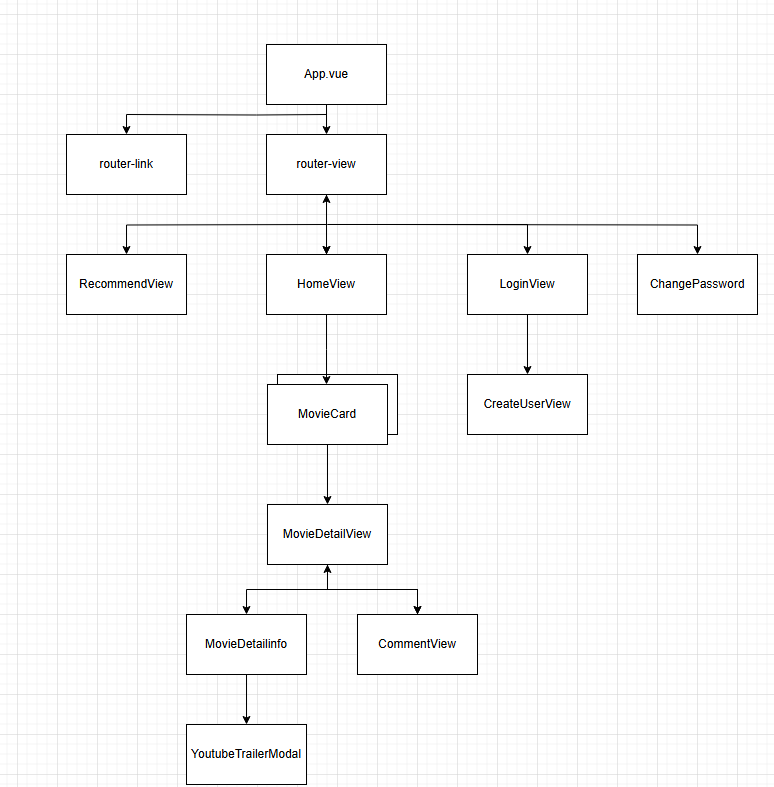

# 프론트 프로젝트 일지

## 담당부분
- frontend 이범진
-  backend 이윤호 

### 개발도구 
1. vscode 
2. Google chrome
3. Node.js LTS
4. Vue 3
5. pinia (pinia-plugin-persistedstate)
6. Vuetify
7. axios

### 활용 API
  1. tmdb
### 계획  
  내일끝난다
### 컴포넌트 설계도
<<<<<<< HEAD

=======

>>>>>>> fb9e9290da1c29fc8f048cbbc7f8033aff984695

1. 일차 (2024-11-18)
  - 로그인,회원가입 기능 구현
    - pinia를 사용하여 store에 counter.js 에 함수 구현
    - 회원가입과 로그인시 자동으로 HomeView로 전환 및 회원가입시 자동로그인
    - 회원가입시  유저 id와 비밀번호 입력 
    - 비로그인으로 home외의 다른 라우터 접근시 알림창으로 로그인 상태 확인 알림 및  로그인 컴포넌트 전환
    - 회원가입시 axios post 로  db에 요청 인증토큰발급
    - 로그인시 회원가입시 발급된 인증토큰 보유
  - 기본 App.vue에서 Login Router 및 임시 컴포넌트 router 들 지정 

2. 일차 (2024-11-19)
  - 로그아웃 구현
    - 로그인시에는 기존 로그인 routerlink가 로그아웃 routerlink 변경
      - v-if 조건으로  store에 username이 존재할때 출력 으로 입력 
      - 비로그인일시 header에 Guest 문구 출력 , 로그인일시 username 출력
    - axios로 로그인할때 받아온 인증토큰 전송하여  로그아웃, 기존에 저장한 계정정보들 null 후 로그인 컴포넌트 router.push
    - 비밀번호 변경 router 생성
      - 로그인시 네비게이션 header의 username 밑에 생성
      - click시 비밀번호 변경 component 출력 

3. 일차 (2024-11-20)
  - HomeView에 영화List component를 출력
  - onmount를 사용하여  axios로  tmdb의 영화정보를 받으며 list 출력
  - 디테일정보 컴포넌트  생성 = 영화List들을 카드로 만듬  
    - click시 해당 영화정보 DetailView로 해당 영화 정보와 modal을 통한 유튜브 트레일러 영상 출력기능 
  - 댓글입력창 생성 (컴포넌트 아님)
  - 해당 영화에 댓글창 컴포넌트 생성
    - DetailView 출력시 댓글창 data 받아옴 
    - 댓글 입력후 제출시, 댓글이 추가되어 댓글창 상단에 즉시출력 

4. 일차 (2024-11-21)
  - DetailView 의 댓글 수정,삭제 기능 추가
    - db에서 id를 받아와 본인의 댓글만 수정삭제 버튼이 출력되게함
      - v-if store.username== comment.id 
  - 좌측 네비게이션바와  출력 컴포넌트의 비율을 맞춤
    - 네비게이션이  추력 컴포넌트를 간섭하여 정상출력이 안되는것을 수정
  - 계정삭제 
    - axios로 db에 지정한 url주소로 인증토큰과 함께 delete메소드를 보내어 삭제
    - localhost에 저장한 정보들 삭제
5. 일차 (2024-11-22)
  - 검색기능 구현
    - 검색창을 구현하고 , 검색창에 작성한 검색어를 기준으로 검색
  - Card 수정
  - detail 페이지 보여주는것 수정
  - 댓글 입력창 수정

6. 일차 (2024-11-25)
  - Home에서 보여주는  card를 스와이퍼로 설정
    - npm instll swiper와 컴포넌트 내에서만 활성화 하였을 때는 작동을안함
      - main.js에서 swiper설정을 전역적으로 바꾼뒤  정상작동 확인

7. 일차 (2024-11-26)
  - 개인 프로필 페이지 생성 
  - 영화 좋아요 기능 
<<<<<<< HEAD
    - 개인 프로필에서  좋아요를 누른 영화 출력
=======
    - 개인 프로필에서  좋아요를 누른 영화 출력
>>>>>>> fb9e9290da1c29fc8f048cbbc7f8033aff984695
