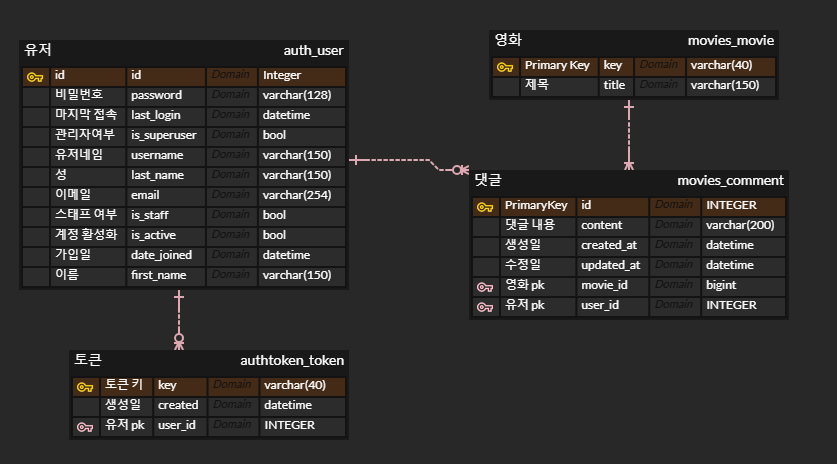
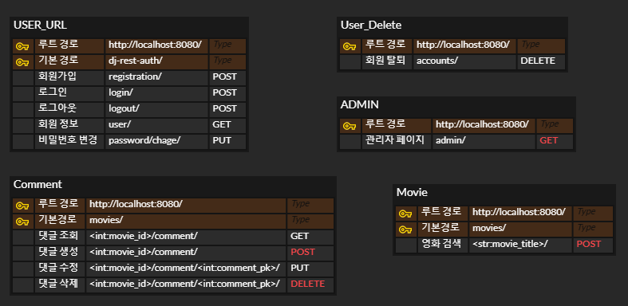

# 2024.11.18(월) 
- create project
- create backend 
- install dj-rest-auth[with_social] 
- requirements.txt
- join, login (functionally worked )
- create accounts app 

# 2024.11.19(화)
- create movies, comments app
- create Comment model, get, post, update, delete views

# 2024.11.20(수)
- comment get,post 테스트 완료
- front 완료되는대로 put,delete 테스트 진행 예정
- django ec2 배포 진행중

# 2024.11.21(목)
- comment put,delete 테스트 완료
- accounts delete postman test > passed
- django ec2 instance 생성 완료
- github actions 빌드 테스트 완료
- ERD 작성 완료
- 

- ec2 instance에 deployment 진행중 (완료 후 github actions와 연동)
- S3 bucket, RDS 진행 예정
- 검색 기능 구현 예정

# 2024.11.22(금)
- EC2, Github Actions 활용한 자동화 배포 파이프라인 구현 완료

# 2024.11.23(토)
- RDS, S3 Bucket 연결 완료

# 2024.11.24(일)
- EC2의 VPC내에 Redis 연결 완료

# 2024.11.25(월)
- IAM 정책 설정, AWS-CLI를 통한 DB관련 설정 및 Django 설정 관리

# 2024.11.26(화)
- RDS 데이터 저장 및 기능 테스트 완료
- PPT 작성

# 개발 도구
- DRF(Django Rest Framework)
- AWS
    - EC2 ( 배포 )
    - RDS ( 데이터베이스 관리,  )
    - S3 Bucket ( 파일 저장, 이미지 및 동영상 외 다양한 데이터 저장 가능 )
    - IAM ( 정책 관리, User, Role, Policy )
    - KMS ( Key Management Service, 키 관리 )
    - System Manager ( 환경 변수 관리, CI/CD 및 DB연결시 Credential을 획득하는데 활용되는 서비스 )
- Github Actions ( CI/CD 파이프라인 구축, Github를 사용시 연결된 서비스로 편하게 이용 가능하는 장점과 템플릿 제공 )
- Redis ( NOSQL DB, 확장성 고려, 기본 제공되는 자동 백업 서비스인 RDB, AOF를 근거로 채택, 메시징, 캐싱, 세션 관리 등 다양한 장점이 있음 )

# ER-DIAGRAM

# URL-PATTERN

